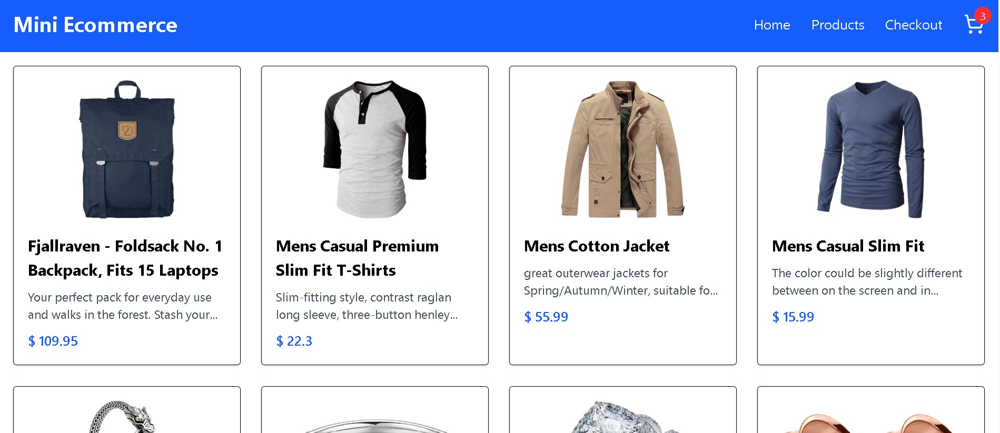
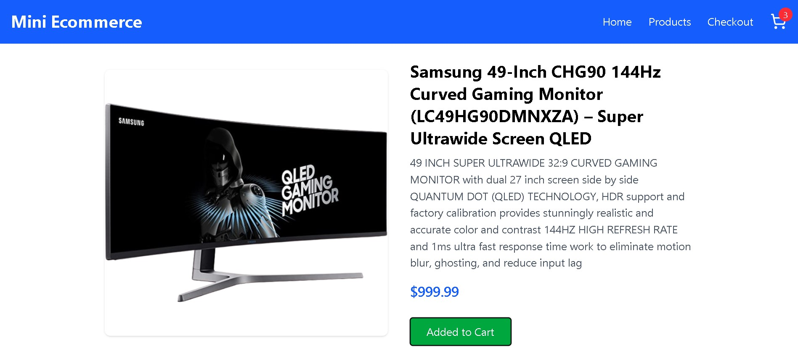
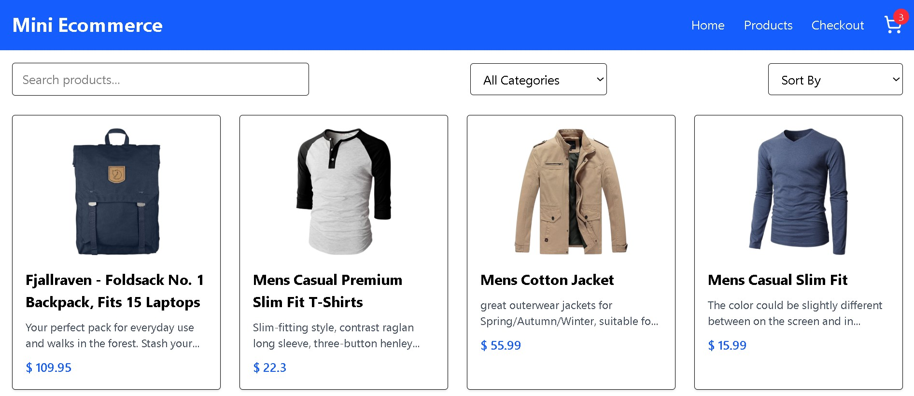
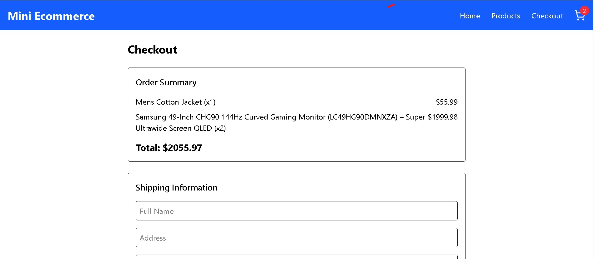
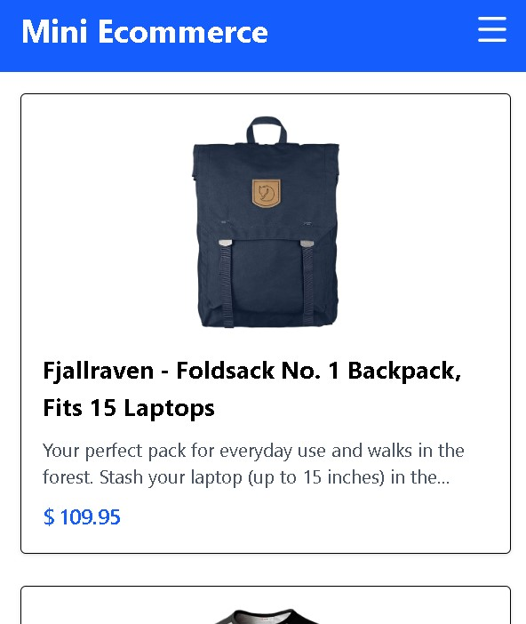

# 🛒 Mini Ecommerce (React + Redux + Tailwind)

A modern **mini ecommerce application** built with **React, Redux Toolkit, TailwindCSS, and React Router**.  
This project demonstrates my ability to structure applications for scalability, manage global state effectively, and implement features such as authentication, product management, cart persistence, and protected routes.

---

## 🚀 Live Demo

👉 [View on live project](https://mini-ecommerce-ochre.vercel.app/)

---

## 🎯 Features

### ✅ Core Functionality

- **Product Listing**
  - Search, filter, sort, and pagination (8 products per page)
- **Product Detail Page**
  - Fetch product by ID
  - Add to cart functionality
- **Shopping Cart**
  - Add/remove items
  - Increase/decrease quantity
  - Clear cart
  - Persistent cart state (localStorage)
- **Checkout**
  - Protected route (requires login)
  - Displays order summary

### ✅ Authentication (Mock)

- JWT stored in **Redux + localStorage**
- Mock login/logout flow
- Protected routes (e.g., `/checkout`)
- Dynamic Navbar with Login/Logout toggle

### ✅ Styling

- TailwindCSS for responsive and elegant UI
- Dynamic components (badge count, navbar toggle, buttons with hover effects)

---

## 🧩 Project Structure

src/
├── app/
│ └── store.js
├── features/
│ ├── auth/
│ │ ├── authSlice.js
│ │ └── LoginPage.jsx
│ ├── cart/
│ │ ├── cartSlice.js
│ │ └── CartPage.jsx
│ └── products/
│ ├── productSlice.js
│ ├── ProductList.jsx
│ └── ProductDetail.jsx
├── components/
│ └── Navbar.jsx
├── pages/
│ ├── Home.jsx
│ ├── Products.jsx
│ ├── Checkout.jsx
│ └── ProtectedRoute.jsx
├── App.js
└── index.js


This modular folder structure keeps **features isolated** and **scales easily** as the app grows.

---

## 🛠️ Tech Stack

- **Frontend**: React (Hooks, Router)
- **State Management**: Redux Toolkit
- **Styling**: TailwindCSS
- **Authentication**: Mock JWT stored in Redux + localStorage
- **Deployment**: Vercel

---

## 🔍 My Thought Process

1. **Start with State Management**

   - Decided to use **Redux Toolkit** for predictable state and scalability.
   - Created `productSlice`, `cartSlice`, and `authSlice` to isolate concerns.

2. **Build Features Incrementally**

   - Began with `ProductList` and `ProductDetail`.
   - Added **CartPage** with persistence.
   - Integrated **auth + protected routes** last.

3. **Problem Solving**

   - Fixed “cart count not updating” by connecting Navbar to Redux store.
   - Solved cart persistence by syncing state with localStorage.
   - Handled navigation guard with `ProtectedRoute`.

4. **User Experience**
   - Clean UI with Tailwind (responsive grid, badge counts, hover states).
   - Smooth mobile navigation toggle.

---

## 📸 Screenshots

### 🏠 Home Page



_Product listing with grid layout, search, filter, and sort._

### 📄 Product Detail



_Product info with “Add to Cart” functionality._

### 🛒 Cart Page


_Dynamic cart with quantity updates and total calculation._

### Products Page


All _Products listing with grid layout, search, filter, and sort._

### Checkout Page



### Mobile responsiveness



---

## 🧪 Future Improvements

- ✅ Integrate a real backend (Node.js / Django REST API)
- ✅ Add Stripe or M-Pesa for real payments
- ✅ Add order history for authenticated users
- ✅ Improve UI/UX with animations (Framer Motion)

---

## 📦 Installation & Setup

```bash
# Clone repo
git clone https://github.com/your-username/mini-ecommerce.git
cd mini-ecommerce

# Install dependencies
npm install

# Run development server
npm start

# Build for production
npm run build
⚡ Deployment (Vercel)
Push code to GitHub.

Connect repository to Vercel.

Deploy with one click.
```
